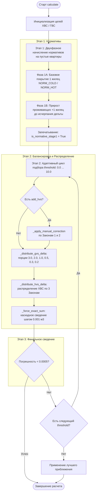

# Полный технический контекст бэкенда: WaterMetrics

Данный документ содержит исчерпывающее описание архитектуры, моделей данных, алгоритмов и принципов работы бэкенд-составляющей проекта **WaterMetrics** (системы биллинга, расчета и генерации отчетности по водопотреблению многоквартирных домов).

---

## 1. Общий обзор системы (Backend Overview)

**WaterMetrics** — специализированное приложение для автоматизации расчёта объёмов потребления холодной (ХВС) и горячей (ГВС) воды в разрезе многоквартирных домов. 

### Основные задачи бэкенда:
1. **Парсинг входных Excel-файлов**:
   - Шаблон предыдущего периода (реестр по квартирам со структурой счётчиков, предыдущими и текущими показаниями).
   - Выгрузка из биллинговой системы «Аркус» с фактическими расходами текущего месяца.
2. **Сдвиг расчетного периода**:
   - Автоматический перенос показаний: `Новые_Предыдущие = Старые_Текущие` (или `Старые_Предыдущие`, если ячейка текущих была пустой).
   - Инкремент месяца в заголовке листа, шапке таблицы (Именительный падеж: `"ЗА ИЮЛЬ 2026 ГОДА"`) и подзаголовках.
3. **Математический балансировочный расчёт**:
   - Двухфазное синхронное начисление нормативов на пустые квартиры.
   - Корректировка целевых объёмов с соблюдением **3 Законов Человеческого Ввода**.
   - Адаптивный итерационный подбор распределения дельт ХВС и ГВС с контролем физического правила $Cons_{ХВС} \ge Cons_{ГВС} - \text{threshold}$.
   - Каскадное сведение сумм до 100% точности (допуск погрешности $< 0.0005\text{ м}^3$).
4. **Управление заменами приборов учета**:
   - Обработка снятых (закрытых) ИПУ с вынесением в отдельный блок таблицы.
   - Включение новых счетчиков со стартовыми показаниями.
5. **Генерация итогового отчёта Excel (`.xlsx`)**:
   - Строгое соответствие корпоративным стилям шрифтов (шрифт **Tahoma 8.5 pt**, заголовки, рамки, выравнивание).
   - Вставка блока «Закрытые ИПУ».
   - Пересчёт и оформление строки «Итого».
   - Вставка динамической строки подписи директора (**Tahoma 11 pt**).
   - Автоподбор ширины столбцов и безопасная обработка блокировок файлов в Excel (`PermissionError` fallback).
6. **Персистентность истории**:
   - Сервис отслеживания открытых и обработанных отчетов с валидацией существования файлов на диске.

---

## 2. Структура файлов и модулей бэкенда

```
├── config.py                  # Глобальная конфигурация, пути и константы
├── models.py                  # Модели данных (dataclasses) предметной области
├── services/
│   └── history_service.py     # Сервис персистентного хранения истории файлов
├── core/
│   ├── excel_parser.py        # ExcelManager: чтение, валидация, сдвиг периодов, запись .xlsx
│   └── calculator.py          # WaterCalculator: математическое ядро расчётов и балансировки
└── main.py                    # Точка входа в приложение (инициализация PySide6 и OpenGL)
```

---

## 3. Модуль конфигурации (`config.py`)

Модуль определяет системные константы, пути хранения служебных данных и цветовую палитру:

| Параметр / Константа | Значение / Назначение | Описание |
| :--- | :--- | :--- |
| `DEFAULT_NORM_COLD` | `4.04` | Стандартный норматив потребления ХВС на 1 человека ($\text{м}^3$) |
| `DEFAULT_NORM_HOT` | `2.65` | Стандартный норматив потребления ГВС на 1 человека ($\text{м}^3$) |
| `DATA_DIR` | `~/.watermetrics` | Рабочая папка пользователя для хранения настроек и дампов |
| `HISTORY_FILE` | `~/.watermetrics/history.json` | JSON-файл хранения истории недавно сформированных отчётов |
| `BACKUP_DIR` | `~/.watermetrics/backups` | Папка резервных копий отчётов |
| `THEME` | `dict` | Цветовые токены интерфейса (бирюзово-изумрудная гамма Dark Azure) |

При импорте модуля гарантируется создание директории `BACKUP_DIR` (`os.makedirs(BACKUP_DIR, exist_ok=True)`).

---

## 4. Модели данных (`models.py`)

Все структуры данных типизированы с использованием стандартного модуля `@dataclass`:

### 4.1. `ClosedMeterRecord`
Хранит информацию о демонтированном (закрытом) приборе учета:
- `apartment: str` — наименование абонента (например: `"квартира 86"`).
- `water_type: str` — тип ресурса (`'cold'` или `'hot'`).
- `meter_num: int` — порядковый номер прибора учета данного типа (1, 2 и т.д.).
- `final_reading: float` — показания на момент снятия (в отчете устанавливается `Предыдущее = Текущее = final_reading`, `Расход = 0.0`).

### 4.2. `NewMeterRecord`
Хранит информацию о вновь установленном приборе учета:
- `apartment: str` — наименование абонента.
- `water_type: str` — тип ресурса (`'cold'` или `'hot'`).
- `meter_num: int` — порядковый номер прибора.
- `initial_reading: float` — стартовые показания ввода в эксплуатацию (записываются в колонку `Предыдущие` основной таблицы).

### 4.3. `CalculationConfig`
Хранит полный набор параметров для выполнения расчетной сессии:
- `target_cold: float` — целевой суммарный объем ХВС ($\text{м}^3$).
- `target_hot: float` — целевой суммарный объем ГВС ($\text{м}^3$).
- `add_hvs: float` — величина ручной корректировки ХВС ($\text{м}^3$, может быть положительной или отрицательной).
- `norm_cold: float` — норматив ХВС на 1 человека.
- `norm_hot: float` — норматив ГВС на 1 человека.
- `template_path: str` — абсолютный путь к файлу шаблона (предыдущий месяц).
- `arcus_path: str` — абсолютный путь к файлу выгрузки Аркус.
- `save_path: str` — целевой путь сохранения результирующего Excel-файла.
- `closed_meters: List[ClosedMeterRecord]` — список закрытых счетчиков.
- `new_meters: List[NewMeterRecord]` — список новых счетчиков.

---

## 5. Сервис истории (`services/history_service.py`)

Класс `HistoryService` реализует статические методы работы с журналом недавно созданных отчётов:

- **`load() -> List[str]`**:
  - Считывает пути из `~/.watermetrics/history.json`.
  - Выполняет валидацию физического присутствия файлов на диске (`os.path.isfile(p)`).
  - При обнаружении удалённых файлов автоматически перезаписывает очищенный список.
- **`save(paths: List[str]) -> None`**:
  - Атомарно сериализует список в JSON с форматированием `indent=4` и кодировкой `UTF-8`.
- **`add_path(path: str) -> List[str]`**:
  - Нормализует путь (`os.path.normpath`), удаляет предыдущие вхождения (дедупликация), помещает путь в начало списка (MRU — Most Recently Used) и сохраняет на диск.
- **`clear() -> None`**:
  - Сбрасывает историю в пустой список.

---

## 6. Модуль работы с Excel (`core/excel_parser.py`)

Класс `ExcelManager` обеспечивает всю работу со структурой и стилями рабочих книг `openpyxl`.

### 6.1. Ключевые методы парсинга и анализа
1. **`parse_house_and_next_month(template_path: str) -> str`**:
   - Считывает строку №2 шаблона.
   - С помощью регулярных выражений извлекает адрес/название объекта (например, `"Душистая 45"`).
   - Обрабатывает спец-объекты (например, `"гассия6а"`, `"аверкиева38"`, `"посадского42"`), добавляя постфикс `" ЮД"`.
   - Возвращает рекомендованное имя выходного файла: `"<Дом>.xlsx"`.

2. **`_parse_meters(ws, detail_row, col_entries) -> List[dict]`**:
   - Анализирует шапку таблицы и находит триплеты столбцов: `(Предыдущее, Текущее, Расход)`.
   - Сканирует строки заголовков вверх (до 8 строк) с учётом объединённых ячеек (`ws.merged_cells`), определяя:
     - Тип воды: `cold` (ХВС) или `hot` (ГВС).
     - Номер счетчика: извлекает номер из текста (`"№1"`, `"счетчик 2"`, `"хвс 1"`).
   - Возвращает упорядоченный список словарей описания счётчиков с номерами колонок.

3. **`extract_apartments_and_meters(template_path, logger) -> dict`**:
   - Извлекает перечень квартир и счетчиков с их базовыми показаниями.
   - Применяет **сдвиг месяцев**: Новые предыдущие = Текущие прошлого месяца.
   - Игнорирует итоговые строки, подвалы, лестничные клетки и блоки закрытых счетчиков.

4. **`extract_data(template_path, arcus_path, logger)`**:
   - Загружает шаблон и выгрузку Аркус.
   - Сопоставляет абонентов по нормализованным именам (`normalize_name`).
   - Сопоставляет колонки счетчиков шаблона и Аркуса.
   - Считывает фактические объемы расхода, флаги пустоты (`is_empty`), зачеркнутый шрифт (`striked`), а также определяет начисления «по среднему» (числа с 3 знаками после запятой: `has_3dec`).
   - Возвращает структуру `all_rows`, метаданные счетчиков, строки для удаления и индекс колонки с наименованием.

### 6.2. Логика сдвига дат и заголовков (`_update_header_and_sheet_name`)
- **Имя листа**: извлекает `MM.YYYY` из названия листа, прибавляет +1 месяц (с переходом года $12 \to 01$) и устанавливает `ws.title = "MM.YYYY"`.
- **Строка №1 (Заголовок)**:
  - Форматирует месяц в **Именительном падеже заглавными буквами** (`"ЗА ИЮЛЬ 2026 ГОДА"`).
  - Заменяет шаблонные маркеры вида `ЗА [МЕСЯЦ] [ГОД]`.
- **Строка №2 (Подзаголовок)**:
  - Заменяет наименование месяца и год с сохранением исходного регистра и падежа.

### 6.3. Формирование и сохранение отчета (`save_result`)
- **Заполнение показаний**:
  - `Предыдущее` = значение из словаря `prev` (или из `new_meters` для вновь введенных ИПУ).
  - `Расход` = итоговый рассчитанный объем из `consum`.
  - `Текущее` = $\text{Предыдущее} + \text{Расход}$ (округление до 3 знаков).
  - Если в исходнике ячейка была зачеркнутой (`strike`), стиль сохраняется.
- **Очистка служебных строк**:
  - Физическое удаление старых строк подвалов/закрытых счетчиков снизу вверх.
- **Вставка блока «Закрытые ИПУ»**:
  - При наличии `closed_meters` вставляет строки перед строкой «Итого».
  - Заполняет заголовок `"Закрытые ИПУ"`, строки квартир с конечными показаниями (`Предыдущее = final_reading`, `Текущее = final_reading`, `Расход = 0.0`).
- **Оформление строки «Итого»**:
  - Пересчитывает точные суммы по всем колонкам расхода.
- **Типографика и стили**:
  - **Основная таблица**: шрифт `Tahoma`, размер `8.5 pt`, тонкие чёрные рамки `thin`, выравнивание числовых колонок по правому краю.
  - **Подпись**: строка `tot_r + 3`, текст: `Директор ООО "Южный дом"  Бочарова В.М.               ___________________`, объединенная ячейка по ширине таблицы, выравнивание по правому краю, шрифт `Tahoma 11 pt`.
- **Авто-ширина столбцов**:
  - Расчет ширины колонок по максимальной длине содержимого (`max_len + 3` или `max_len + 4` для колонки с именем).
- **Защита от блокировки файла**:
  - Если целевой файл открыт в Microsoft Excel (`PermissionError`), файл сохраняется с временной меткой (`<Имя>_HHMMSS.xlsx`), а пользователю выбрасывается информативное исключение.

---

## 7. Математическое расчетное ядро (`core/calculator.py`)

Класс `WaterCalculator` реализует биллинговый алгоритм распределения объемов воды с защитой от искажения данных.

### 7.1. «3 Закона Человеческого Ввода» (Core Axioms)

1. **Закон 1 (Закон целых чисел)**:
   - Если абонент передает целые показания (расход $1.0, 2.0, 3.0\text{ м}^3$), любые корректировки и начисления должны производиться **только целыми кубами** ($+1.0, +2.0, -1.0$). Запрещено начислять дробные доли (например, $1.15\text{ м}^3$) на счетчики с целым потреблением.
2. **Закон 2 (Закон «Каменных стен» / Защита нормативов)**:
   - Квартиры, получившие нормативное начисление на Этапе 1 (`is_normative_stage1 = True`), а также квартиры с нулевым расходом ($0.0\text{ м}^3$), **строго запечатаны**. Запрещено добавлять к ним мелкие копейки, дельты и сдвиги.
3. **Закон 3 (Закон дробных остатков)**:
   - Все дробные доли и копейки ($0.001 \dots 0.999\text{ м}^3$), возникающие при распределении дельт и финальном сведении баланса, направляются **исключительно на счетчики, которые исторически имеют дробные показания** либо начисления «по среднему» (3 знака после запятой в Аркусе).

### 7.2. Вспомогательные предикторы и ограничения

- **`_is_3dec_meter(ap, key)`**: определение начислений «по среднему» из Аркуса (разница между 2 и 3 знаками $> 10^{-5}$).
- **`_is_prev_fractional_meter(ap, key)`**: проверка, были ли предыдущие показания дробными.
- **`_is_integer_meter(ap, key)`**: проверка целостности расхода ($\ge 0.2\text{ м}^3$ и без дробной части).
- **`_is_fractional_meter(ap, key)`**: проверка дробности расхода.
- **Физическое ограничение соотношения ХВС и ГВС**:
  - $Cons_{ХВС} \ge Cons_{ГВС} - \text{threshold}$
  - Проверяется методами `_can_add_gvs` и `_can_sub_hvs`. Не позволяет горячей воде превысить объем холодной воды в квартире свыше заданного порога ослабления.

---

### 7.3. Пошаговый пайплайн работы метода `calculate()`



---

### 7.4. Детальное описание этапов расчёта

#### **Этап 1: Двухфазное синхронное начисление нормативов**
- Определяются квартиры без расхода по всем счетчикам (`empty_apts`).
- **Фаза 1A (Базовое покрытие)**:
  - Каждой пустой квартире начисляется базовый норматив на **1-й счётчик** (`f_key_cold`, `f_key_hot`): $4.04\text{ м}^3$ для ХВС и $2.65\text{ м}^3$ для ГВС (при наличии ресурса и непревышении целевого объема).
- **Фаза 1B (Прирост проживающих)**:
  - Если после Фазы 1A остается нераспределенный целевой объем, на ранее покрытые квартиры синхронно добавляется норматив на $+1$ жильца ($+4.04$ и $+2.65$).
- Все квартиры, получившие норматив, помечаются флагом `is_normative_stage1 = True` и исключаются из дальнейших модификаций.

#### **Этап 2: Ручная коррекция и адаптивный цикл распределения дельт**
- **Ручная коррекция (`_apply_manual_correction`)**:
  - При значении `add_hvs != 0` и подтверждении пользователем: целая часть распределяется порциями по $1.0\text{ м}^3$, дробный остаток направляется на дробные счетчики с соблюдением физического лимита ХВС/ГВС.
- **Адаптивный цикл подбора порога (`thresholds = [0.0, 1.0, 2.0, ..., 10.0]`)**:
  - Если при строгом балансе $Cons_{ХВС} \ge Cons_{ГВС}$ невозможно свести суммы (например, большой объем ГВС), алгоритм плавно ослабляет ограничение на $1.0\text{ м}^3$ за шаг.
- **Распределение ГВС (`_distribute_gvs_delta`)**:
  - Дельта ГВС распределяется порциями: $+3.0, +2.0, +1.0, +0.5, +0.3, +0.2\text{ м}^3$. Приоритет отдается квартирам с активным потреблением.
- **Распределение ХВС (`_distribute_hvs_delta`)**:
  - Положительная дельта: целая часть порциями $3.0, 2.0, 1.0\text{ м}^3$ на целые счетчики; дробная часть — на дробные.
  - Отрицательная дельта: уменьшение целыми кубами с контролем минимального порога остатка ($0.2\text{ м}^3$) и физического лимита.

#### **Этап 3: Финальное принудительное сведение (`_force_exact_sum`)**
- Гарантирует абсолютную точность сведения к целевым значениям: $|Итог - Цель| < 0.0005\text{ м}^3$.
- **Каскадный отбор кандидатов**:
  - Нормативы ($4.04, 8.08, 2.65\dots$) полностью исключены (Закон 2).
  - Целые числа исключены (Закон 1).
  - **Приоритет 1 (P1)**: счетчики с исторически дробными показаниями или начислениями по среднему (3 знака), $val \ge 0.2\text{ м}^3$.
  - **Приоритет 2 (P2, Fallback)**: любые дробные счетчики с $val \ge 0.2\text{ м}^3$.
- Дискретная подгонка выполняется минимальным шагом $\pm 0.001\text{ м}^3$.

---

## 8. Входная точка приложения (`main.py`)

- Настраивает глобальный формат поверхности OpenGL: `OpenGL 3.3 Core Profile` с 4x MSAA (`fmt.setSamples(4)`) до создания экземпляра `QApplication`.
- Инициализирует `QApplication`.
- Подгружает системную иконку `assets/app_icon.ico` (с поддержкой режима сборки PyInstaller `sys._MEIPASS`).
- Применяет глобальную стилизацию QSS `DARK_AZURE_QSS`.
- Создает и отображает главное окно `MainWindow`.

---

## 9. Взаимодействие компонентов (Интеграционный Dataflow)

```
[Шаблон Excel (.xlsx)] + [Выгрузка Аркус (.xlsx)]
           │
           ▼
     ExcelManager.extract_data()
           │
           │  (структуры all_rows, meters, meter_by_type)
           ▼
     WaterCalculator.calculate(all_rows, meters, meter_by_type)
           │
           │  (расчет consum, сведение дельт, защита нормативов)
           ▼
     ExcelManager.save_result(...)
           │
           ▼
[Итоговый Реестр .xlsx (Сдвиг месяца, Tahoma 8.5 pt, Подпись)]
```

---

## 10. Резюме ключевых гарантий бэкенда

1. **Целостность данных**: Ни один целый счетчик не получает искусственных копеек; ни один норматив не искажается.
2. **Точность**: Расчетные суммы ХВС и ГВС сходятся с целевыми значениями с точностью до $0.001\text{ м}^3$.
3. **Соответствие ГОСТ/Стандартам**: Выходной документ строго воспроизводит корпоративную сетку стилей, падежи месяцев и подписи.
4. **Отказоустойчивость**: Безопасный парсинг чисел (запятые, точки, пробелы, `None`), обработка блокировок файлов в Excel и валидация путей в истории.
